# Gramados e resultados do Brasileirão — 2023–2024

**Autor:** Enzo de Sousa Lopes  
**Plataforma:** Databricks Free Edition — processamento em nuvem com PySpark e SQL  
**Repositório:** [mvp-gramados-brasileirao](https://github.com/enzolopesz/mvp-gramados-brasileirao)

Os resultados correspondem à execução documentada, com **737 partidas elegíveis** entre as 760 partidas de 2023–2024.

## 1. Contexto de Negócios e Perguntas (Etapas 2 e 4.1)

### Problema e objetivo

O uso de gramados sintéticos no futebol motiva discussões sobre desempenho e vantagem do mandante. Comparar jogos usando apenas o gramado atual do estádio pode produzir classificações históricas incorretas, pois o piso pode mudar ao longo dos anos. Além disso, um clube pode mandar partidas em locais diferentes.

O objetivo deste MVP é construir uma pipeline em nuvem que associe as partidas do Campeonato Brasileiro Série A de 2023 e 2024 ao tipo de gramado pesquisado para o estádio **na data de cada partida**. A partir dessa associação, são comparadas a média do total de gols e a proporção de vitórias do mandante. A análise é descritiva e pode apoiar jornalistas, analistas esportivos e interessados em avaliar afirmações sobre resultados em diferentes pisos, sem atribuir causalidade ao gramado.

### Perguntas de análise

1. Qual é a média de gols por partida em gramados naturais, sintéticos e híbridos?
2. Como varia a taxa de vitória do mandante entre esses tipos de gramado?
3. As diferenças se mantêm em 2023 e 2024?
4. Como os resultados variam quando observados por clube mandante e tipo de gramado?
5. Qual proporção das partidas possui classificação histórica utilizável, e quais exclusões limitam a comparação?

Questões inicialmente consideradas sobre lesões e comportamento da bola permanecem **sem resposta neste MVP**: os conjuntos utilizados não contêm registros de lesões, exposição de atletas, velocidade ou trajetória da bola. Essas questões exigem outras fontes e não podem ser respondidas por placares.

### Coleta e contexto dos dados brutos

A base de partidas foi obtida em CSV no repositório [Brasileirao_Dataset, de adaoduque](https://github.com/adaoduque/Brasileirao_Dataset), arquivo `campeonato-brasileiro-full.csv`. A versão carregada contém **8.785 registros**, de **29/03/2003 a 08/12/2024**, com 16 colunas. O filtro analítico seleciona 760 jogos: 380 em 2023 e 380 em 2024.

| Grupo | Colunas originais |
|---|---|
| Identificação e tempo | `ID`, `rodata`, `data`, `hora` |
| Participantes | `mandante`, `visitante`, `mandante_Estado`, `visitante_Estado` |
| Contexto técnico | `formacao_mandante`, `formacao_visitante`, `tecnico_mandante`, `tecnico_visitante` |
| Resultado e local | `vencedor`, `arena`, `mandante_Placar`, `visitante_Placar` |

A segunda entrada, `gramados.csv`, foi produzida por pesquisa documental de páginas de clubes, órgãos públicos e notícias, inicialmente organizada em planilha. Ela contém **40 registros de nomes de estádio** e seis colunas: `arena`, `tipo_gramado`, `inicio_validade`, `fim_validade`, `fonte_url` e `observacoes`. Nomes diferentes podem representar o mesmo estádio; portanto, 40 nomes não significam necessariamente 40 estádios físicos.

Foram registrados os tipos `natural`, `sintetico`, `hibrido` e `nao_confirmado`. As datas delimitam o intervalo adotado pela pesquisa no recorte, não necessariamente a instalação e a retirada do piso. As fontes e observações registram as evidências e as hipóteses de continuidade. A classificação depende do estádio e da data, e não do clube mandante. Casos não confirmados foram mantidos como pendentes.

A exploração inicial em Excel/Power Query orientou a pesquisa e a conferência; a carga, as transformações, a persistência e os agregados apresentados na entrega foram executados no Databricks e estão nos notebooks públicos. A exportação da pesquisa para CSV utiliza UTF-8, separação por vírgula e datas no formato `yyyy-MM-dd`.

### Licença e uso das fontes

Na consulta realizada ao repositório de origem, não foi identificada uma licença explícita para o conjunto de partidas. Assim, **não se atribui ao dataset uma licença aberta presumida** apenas por estar publicamente acessível. O autor e a origem são referenciados, e eventual reutilização ou redistribuição deve observar as condições da fonte.

A pesquisa de gramados reúne classificações e referências documentais. As páginas consultadas mantêm seus próprios termos; não se presume uma licença comum nem se reproduzem integralmente seus textos. A disponibilização dos dados não é exigida pelo enunciado; os códigos e a documentação são disponibilizados para avaliação.

## 2. Carga dos Dados (Etapa 4.2)

O notebook [01_preparacao](notebooks/01_preparacao.ipynb) cria o schema `workspace.mvp_gramados` e o volume `arquivos`, quando ainda não existem. Os dois CSVs são enviados ao volume:

```text
/Volumes/workspace/mvp_gramados/arquivos/campeonato-brasileiro-full.csv
/Volumes/workspace/mvp_gramados/arquivos/gramados.csv
```

A leitura usa cabeçalho, suporte a campos multilinha e escape de aspas. Isso preserva células que contêm mais de uma referência. Todas as colunas são inicialmente carregadas como texto. Os DataFrames são persistidos em Delta com `saveAsTable`, formando as tabelas Bronze. A contagem é conferida por leitura das tabelas salvas.

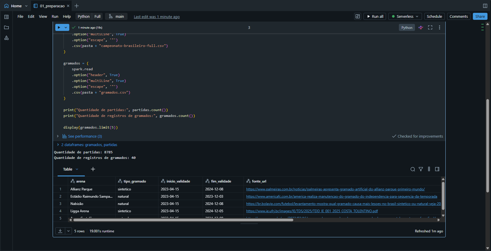

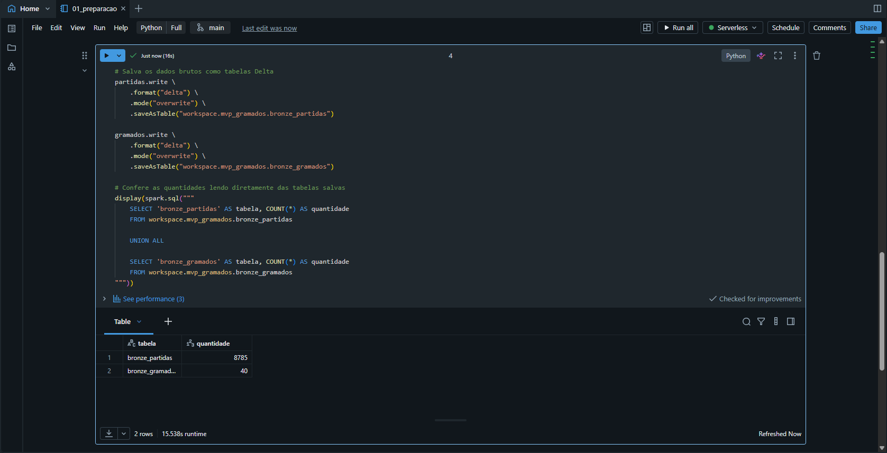

Para reproduzir com as mesmas contagens, é necessário utilizar as mesmas versões dos dois CSVs. O repositório de origem pode mudar; os notebooks atuais leem os arquivos presentes no volume, sem download automático nem verificação de hash. A pesquisa manual de gramados também é uma entrada necessária e não é reconstruída automaticamente pelos notebooks.

## 3. Modelagem e Catálogo de Dados (Etapa 4.3)

Foi adotado um modelo de tabelas planas organizado em Bronze, Silver e Gold. O catálogo transcrito com **as 67 colunas, tipos, descrições, domínios e linhagem** está em [docs/catalogo_dados.md](docs/catalogo_dados.md).

| Tabela | Uma linha representa | Colunas | Registros verificados |
|---|---|---:|---:|
| `bronze_partidas` | Uma partida original | 16 | 8.785 |
| `bronze_gramados` | Um nome de estádio e intervalo pesquisado | 6 | 40 |
| `silver_gramados` | Um registro de pesquisa com datas convertidas | 6 | 40 |
| `silver_partidas_gramados` | Uma partida de 2023–2024 associada à pesquisa | 22 | 760 |
| `gold_resumo_gramado` | Um tipo de gramado | 5 | 3 |
| `gold_resumo_ano_gramado` | Um ano e tipo de gramado | 6 | 6 |
| `gold_resumo_clube_gramado` | Um mandante e tipo de gramado | 6 | Contagem não registrada nas evidências disponíveis |

As chaves lógicas são `ID` nas partidas; `arena` na pesquisa atual; e as colunas de agrupamento em cada Gold. São regras esperadas e verificadas quando aplicável, não restrições de chave declaradas no banco. O modelo atual tem uma linha por nome de estádio na pesquisa. Uma extensão com vários intervalos por nome exigirá revisão da chave e da junção para evitar sobreposições.

Os comentários das sete tabelas e das 22 colunas da Silver de partidas são aplicados em `03_analise`; as outras 45 colunas são documentadas em [05_catalogo_dados](notebooks/05_catalogo_dados.ipynb). A exportação de metadados confirmou as 67 descrições preenchidas.

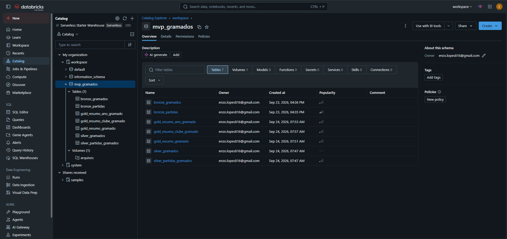

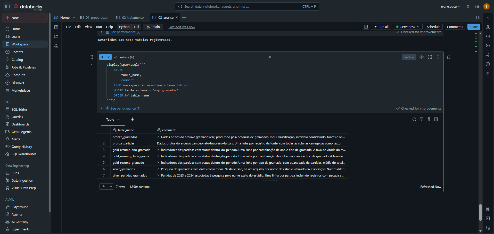


## 4. Pipeline de Dados (Etapa 4.4)

| Ordem | Código | Operação |
|---:|---|---|
| 1 | [01_preparacao](notebooks/01_preparacao.ipynb) | Criação da estrutura, leitura dos CSVs e persistência Bronze |
| 2 | [02_tratamento](notebooks/02_tratamento.ipynb) | Conversão de tipos, filtro temporal, junção, status e persistência Silver |
| 3 | [03_analise](notebooks/03_analise.ipynb) | Indicadores, persistência Gold e parte dos comentários |
| 4 | [04_qualidade_dados](notebooks/04_qualidade_dados.ipynb) | Diagnósticos de qualidade e cobertura |
| 5 | [05_catalogo_dados](notebooks/05_catalogo_dados.ipynb) | Demais comentários e conferência dos metadados |

Na preparação de um ambiente novo, execute primeiro as células de criação de schema/volume do notebook 01, envie os CSVs ao volume e prossiga com a leitura. Depois execute os notebooks na ordem acima, de cima para baixo, em computação Serverless. O usuário deve possuir acesso às tabelas e permissão para criar objetos e alterar seus comentários.

O tratamento renomeia `rodata` para `rodada`, converte ID, rodada e placares para inteiro e converte a data das partidas de `dd/MM/yyyy` para DATE. As datas da pesquisa são convertidas para DATE. Conversões tolerantes produzem nulo se o valor não puder ser convertido; os diagnósticos verificam esses casos.

As partidas entre 01/01/2023 e 31/12/2024 são associadas por **LEFT JOIN com igualdade exata de `arena`**, preservando todos os jogos. Depois é calculado `status_gramado`, considerando a classificação e os limites inclusivos de validade. Não há associação aproximada de nomes nessa implementação em nuvem.

A Gold usa somente `dentro_do_periodo`. Calcula o ano, o total de gols e o indicador binário de vitória do mandante, agregando por gramado, por ano/gramado e por mandante/gramado. As taxas são persistidas entre 0 e 1; a apresentação multiplica por 100. Não se arredondam os valores antes de persistir os agregados.

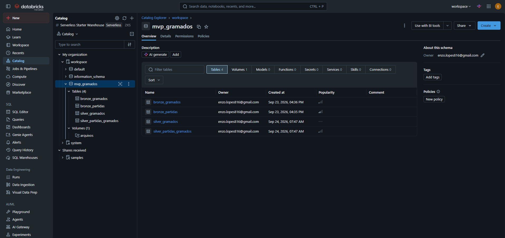

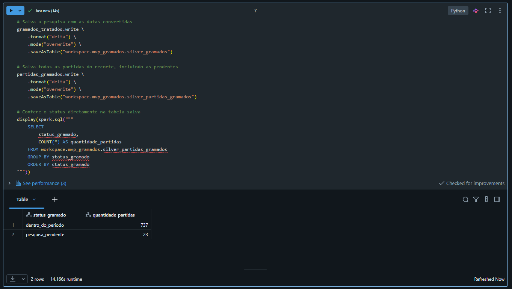

A persistência usa `overwrite`: novas execuções substituem os conteúdos das tabelas de destino. A execução é manual, organizada em notebooks; não foi configurado agendamento. Os diagnósticos exibem resultados e não constituem bloqueios automáticos da pipeline. Os comentários devem ser reaplicados após recriações de tabelas, executando as respectivas células de 03 e 05.

## 5. Qualidade de Dados (Etapa 4.5)

O notebook [04_qualidade_dados](notebooks/04_qualidade_dados.ipynb) avalia completude em todos os 22 atributos das duas entradas e aplica regras específicas conforme o significado dos campos. Ausência corresponde a nulo, texto vazio ou somente espaços. O hífen do vencedor tem significado de empate e não é tratado como ausência.

| Campos / dimensão | Resultado observado | Tratamento e limite |
|---|---|---|
| Formações do mandante e visitante | 4.975 ausentes em cada coluna (56,63% da Bronze histórica) | Preservados; não usados nos indicadores |
| Técnicos do mandante e visitante | 4.610 ausentes em cada coluna (52,48%) | Preservados; nomes não auditados externamente |
| Início e fim de validade | 4 ausentes em cada coluna (10% da pesquisa) | Mantidos como pesquisa pendente; não imputados |
| Demais campos das entradas | Zero ausências pela regra aplicada | Preenchimento não garante exatidão factual |
| ID e linhas completas | Nenhum ID repetido nem duplicatas integrais nas entradas | Sem remoção de duplicatas necessária |
| Arena da pesquisa | Nenhum nome exato repetido | Nomes alternativos do mesmo estádio continuam possíveis |
| ID, rodada e placares | Nenhuma conversão inválida nem valor abaixo do mínimo adotado | ID/rodada ≥ 1; placares ≥ 0 |
| Datas e horários das partidas | Zero ausentes/inválidos nas regras aplicadas | Formato validado; horário real e fuso não auditados |
| Vencedor versus placares | Uma divergência, ID 1114, em 24/04/2005 | Bronze preservada; fora do recorte; indicadores derivados dos placares |
| Mandante, visitante e UFs | Nenhum confronto do clube contra si próprio nem sigla inválida | Não comprova que cada vínculo clube–UF esteja correto |
| Tipo de gramado e datas da pesquisa | Zero categorias inválidas, datas preenchidas inválidas, classificados sem datas ou intervalos invertidos | Validade estrutural; não equivale à comprovação histórica de todos os intervalos |
| Fontes e observações | Preenchidas nos 40 registros | Rastreabilidade documental; conteúdo e continuidade possuem limitações descritas na pesquisa |
| Junção | 760 linhas e 760 IDs distintos | Não multiplicou partidas nesta execução |
| Valores extremos de gols | Total de 0 a 10 no recorte | Mantidos; magnitude isolada não comprova erro |

A divergência de 2005 corresponde a Brasiliense 0 × 1 Vasco com vencedor original `-`. A regra calcula Vasco como vencedor a partir do placar, mas não determina, sem outra fonte, qual campo original está correto. Não foi feita correção factual automática.

Os mínimos e máximos observados na base histórica foram ID 1–8.785, rodada 1–46 e placares 0–7 para cada equipe. Esses máximos são características da amostra, não limites universais. Na inspeção dos 760 jogos, houve quatro partidas com oito gols e uma com dez; não foram descartadas por serem extremas.

### Evidências dos diagnósticos

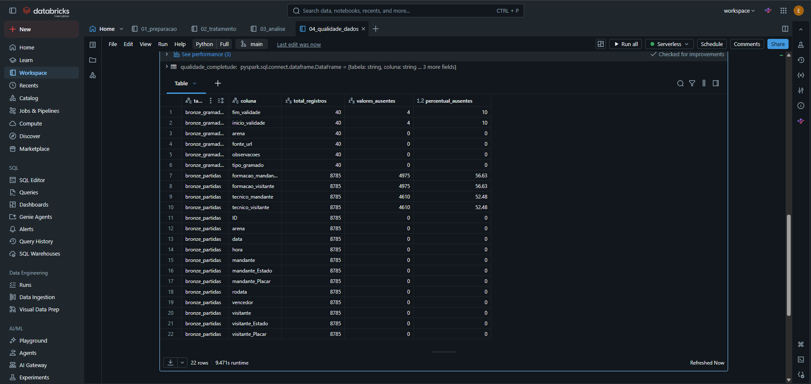

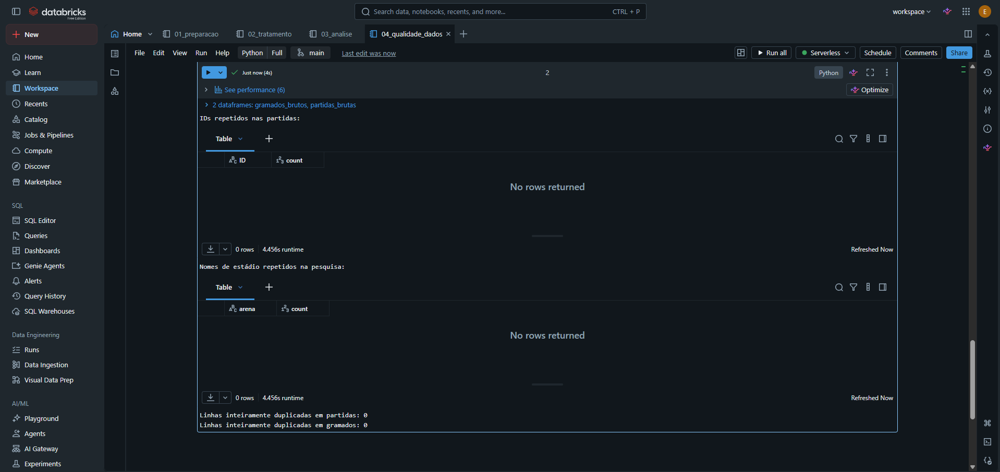

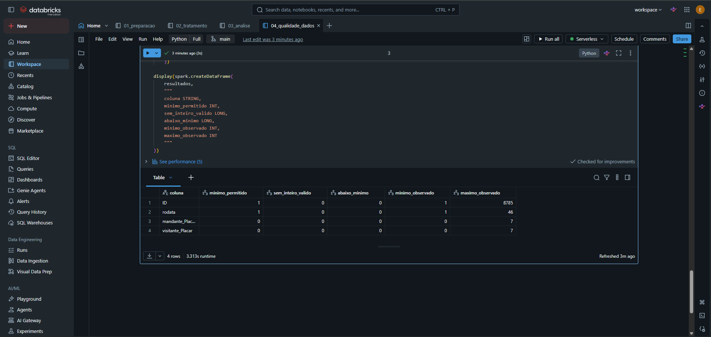

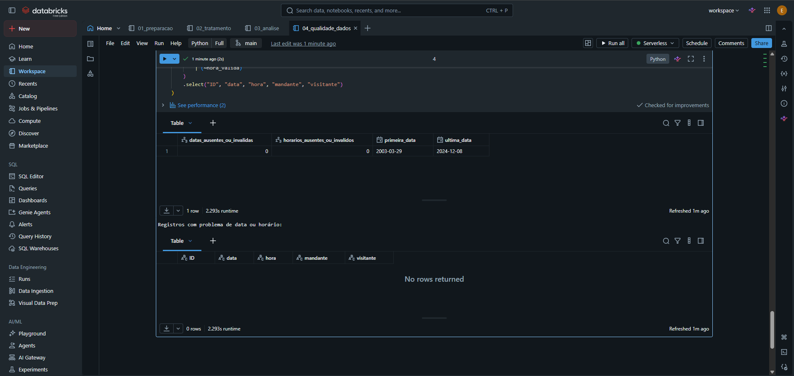

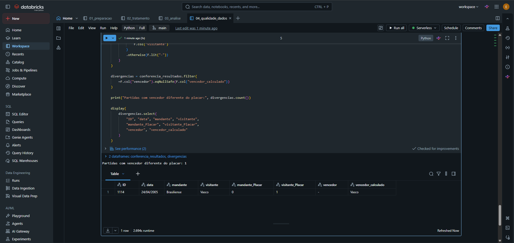

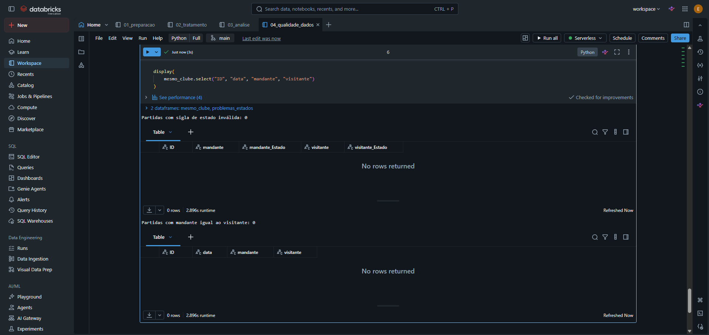

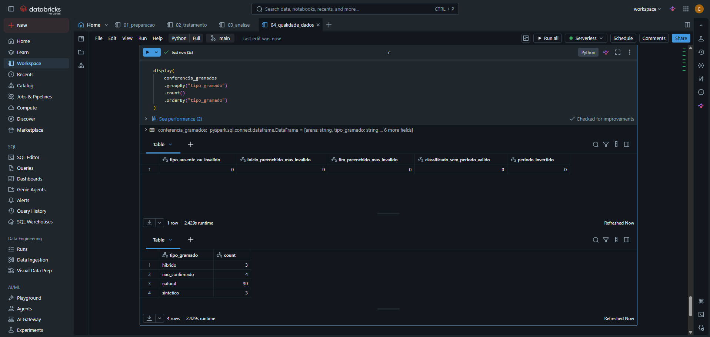

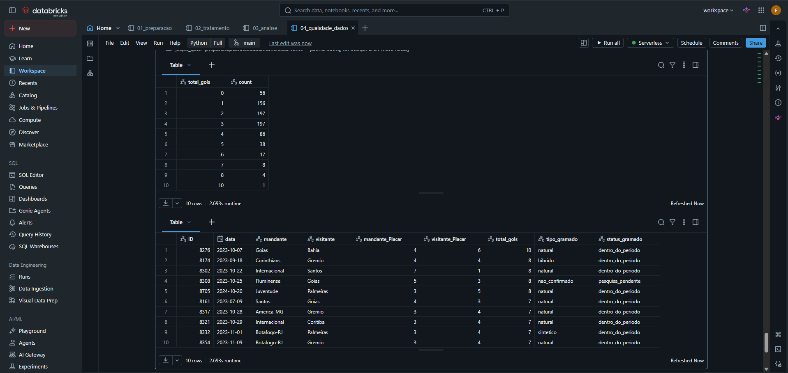

As regras automatizadas não verificam a exatidão de todos os nomes, formações, técnicos ou textos de referência contra fontes externas. Essa é uma limitação da avaliação de qualidade, e não uma afirmação de ausência de erros nesses atributos.

## 6. Análise de Dados (Etapa 4.5)

### Pergunta 1 — Média de gols por tipo de gramado

| Gramado | Partidas | Média de gols |
|---|---:|---:|
| Natural | 515 | 2,449 |
| Sintético | 106 | 2,566 |
| Híbrido | 116 | 2,517 |

Nas partidas elegíveis de 2023–2024, os jogos classificados como sintéticos apresentaram a maior média de gols, aproximadamente 0,117 gol por partida acima dos naturais. A média híbrida ficou entre as duas. São grupos de tamanhos e composição diferentes; o resultado não demonstra efeito causal nem significância estatística.

### Pergunta 2 — Taxa de vitória do mandante

| Gramado | Vitórias do mandante | Partidas | Taxa |
|---|---:|---:|---:|
| Natural | 230 | 515 | 44,66% |
| Sintético | 64 | 106 | 60,38% |
| Híbrido | 55 | 116 | 47,41% |

A taxa em sintético supera a de natural em aproximadamente **15,72 pontos percentuais**, usando os valores apresentados. A taxa de vitória é a razão entre vitórias e partidas do grupo, incluindo empates e derrotas no denominador; não representa aproveitamento de pontos.

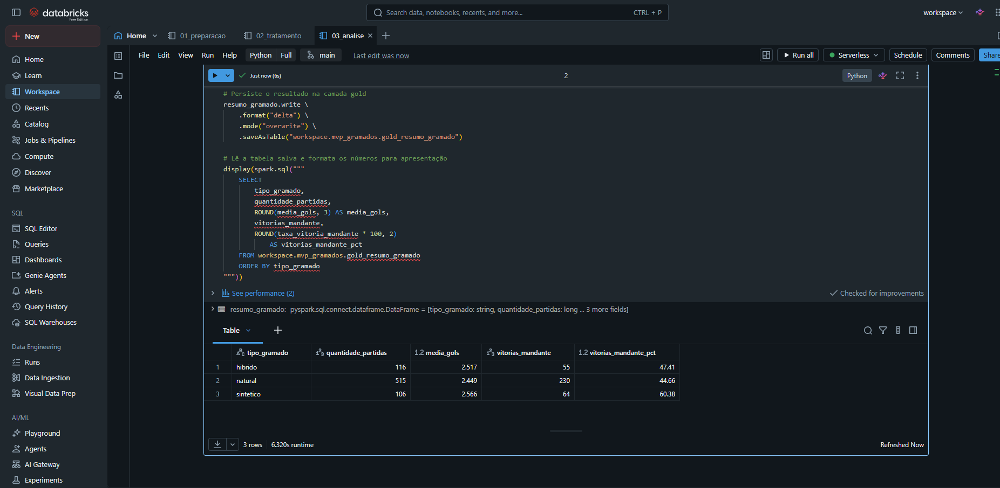

### Pergunta 3 — Comparação entre 2023 e 2024

| Ano | Gramado | Partidas | Média de gols | Vitórias do mandante | Taxa |
|---|---|---:|---:|---:|---:|
| 2023 | Natural | 266 | 2,451 | 113 | 42,48% |
| 2023 | Sintético | 54 | 2,667 | 34 | 62,96% |
| 2023 | Híbrido | 56 | 2,464 | 28 | 50,00% |
| 2024 | Natural | 249 | 2,446 | 117 | 46,99% |
| 2024 | Sintético | 52 | 2,462 | 30 | 57,69% |
| 2024 | Híbrido | 60 | 2,567 | 27 | 45,00% |

A diferença de taxa de vitória entre sintético e natural caiu de **20,48 pontos percentuais em 2023** para **10,70 em 2024**, com base nos valores arredondados. Portanto, a direção da diferença permaneceu, mas sua magnitude diminuiu.

A diferença de média de gols entre sintético e natural também diminuiu: aproximadamente 0,216 em 2023 e 0,016 em 2024. Em 2024, o híbrido teve a maior média de gols. O padrão agregado dos dois anos não se repete integralmente em cada temporada.

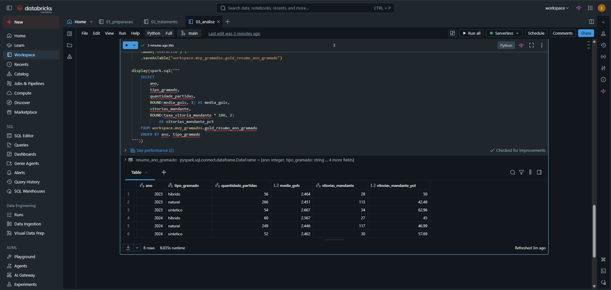

### Pergunta 4 — Comparação por mandante

Os resultados variam entre os clubes mesmo dentro de um mesmo tipo de piso. No sintético, Athletico-PR apresentou 17 vitórias em 38 jogos (44,74%) e Botafogo-RJ 23 em 35 (65,71%). No natural, São Paulo apresentou 25 vitórias em 38 jogos (65,79%), enquanto Cuiabá teve nove em 38 (23,68%). Isso mostra que o tipo de gramado sozinho não resume a variação observada.

As combinações clube/gramado podem ter poucas partidas; por exemplo, Botafogo-RJ aparece com somente dois jogos no natural. Comparações com amostras pequenas são instáveis. Mesmo comparar o mesmo clube em pisos diferentes não isola o gramado, pois adversários, ano e circunstâncias do mando também podem variar. Não foi estimado um modelo que controle essas diferenças.

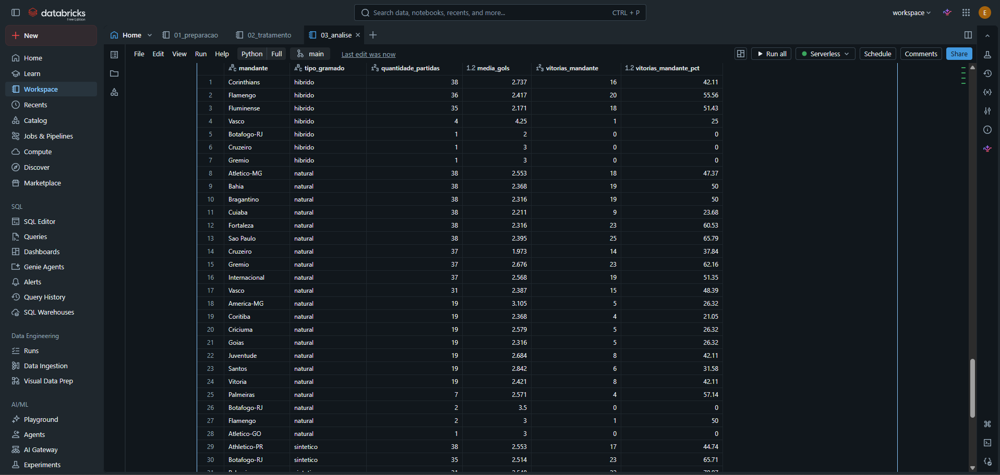

A imagem apresenta parte da tabela por clube. Os exemplos discutidos acima estão visíveis nessa captura; o resultado completo pode ser consultado executando o notebook `03_analise`.

### Pergunta 5 — Cobertura e exclusões

Das 760 partidas do recorte, **737 (96,97%)** possuem status `dentro_do_periodo`. As **23 pendentes (3,03%)** permanecem na Silver e não entram nas agregações Gold.

| Estádio | Partidas pendentes |
|---|---:|
| Antônio Accioly | 18 |
| Raulino de Oliveira | 3 |
| Luso-Brasileiro | 1 |
| Orlando Scarpelli | 1 |

As exclusões se concentram em determinados estádios, especialmente Antônio Accioly; não há fundamento para tratá-las como uma amostra aleatória. Por ano, entram 376 de 380 jogos em 2023 e 361 de 380 em 2024, conforme a soma dos grupos Gold. Essa cobertura desigual deve acompanhar a interpretação das diferenças entre anos.

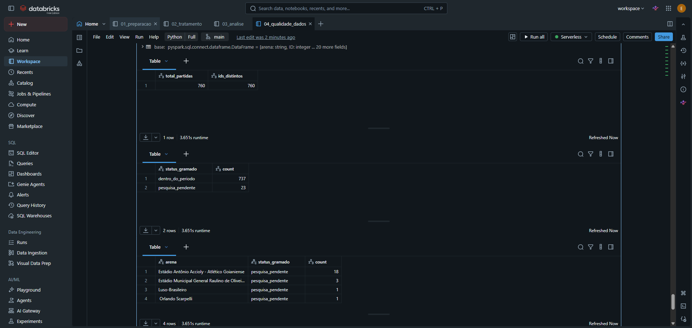

### Discussão geral e limitações

A pipeline permitiu responder às perguntas descritivas sobre gols, vitórias do mandante, variação anual, diferenças por clube e cobertura. Os resultados sustentam a afirmação de que, **na amostra elegível**, o sintético apresentou maior média de gols e maior taxa de vitória do mandante no agregado. Eles não sustentam afirmar que mudar o piso aumentaria as vitórias ou os gols de um clube.

As principais limitações são a composição diferente dos clubes e adversários, a concentração de jogos sintéticos em poucos mandantes, grupos pequenos em alguns cruzamentos, 23 exclusões, hipóteses de continuidade na pesquisa histórica e ausência de auditoria factual de todos os campos. Não foram aplicados testes de significância nem modelos causais. Os dados também não permitem responder sobre lesões ou dinâmica da bola.

## 7. Autoavaliação

Considero que o objetivo de construir uma análise descritiva dos resultados por tipo de gramado foi alcançado, embora a cobertura tenha ficado limitada às partidas com classificação histórica disponível. As perguntas sobre lesões e comportamento da bola não puderam ser respondidas com os dados utilizados.

Tive dificuldades ao longo de praticamente todas as etapas, desde a organização e pesquisa dos dados até a utilização do Databricks e a documentação do projeto. Ainda preciso aprofundar meus conhecimentos para compreender melhor o código e conseguir reproduzir o processo com mais autonomia. A conclusão do trabalho não significa que eu já domine as ferramentas utilizadas.

Como melhoria futura, buscaria dados de outra liga com informações mais completas sobre partidas e gramados, para ampliar as possibilidades de análise. Também avaliaria a qualidade e a comparabilidade desses dados, pois uma quantidade maior de registros, por si só, não garante conclusões mais precisas.
